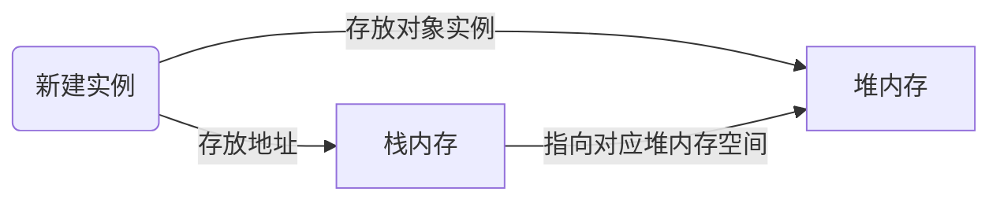

# 学习总结

[toc]

## 一、计算机网络

### 1. OSI七层模型

1.物理层

> 传输【比特】流 
>
> 【网卡】工作层

2.数据链路层

> 如何格式化数据、错误检测和纠正、比特数据组成【帧】
>
> 【交换机】工作 帧解码并发送
>
> 物理寻址，比特流转为逻辑传输线路

3.网络层

> 网络地址翻译成物理地址，路由到接收方，决定最佳路径
>
> 【数据包】 tcp/ip中的ip
>
> 【路由器】

4.传输层

> 主机间传输，传输协议+流量控制
>
> 将数据包进行分割，以正确顺序充足 【数据段】
>
> TCP协和和UDP协议

5.会话层

> 自动收发包自动寻址

6.表示层

>  不同系统间的语义语法

7.应用层

> 规定固定长度消息头，消息头记录长度等信息
>
> http协议

osi实现->TCP/IP

### 2. TCP/IP

transmission control Protocol

面向连接、可靠、基于字节流的传输层控制协议

应用层->会话层、表示层、应用层 【http数据】

传输层->传输层 【TCP头】+【http数据】

网络层->网络层 【TCP头】+【ip头】+【http数据】

链路层->数据链路层、物理层 【以太网头】+【TCP头】+【ip头】+【http数据】

**三次握手**


为什么需要三次

- 初始化sequence number

【syn flood】

> 客户端发送syn后，服务端收到并回复ack，此时没收到ack
>
> server端会重试五次，1+2+4+8+16+32=63秒后断开连接
>
> 队列满后，通过tcp_syncookies参数回传，客户端可用这个直接建立连接

【client出现故障】

> 保活探测，多次失败置为不可达

**四次挥手**


2msl 最长报文段寿命 目的

> 确保足够时间让对方收到ack
>
> 避免新旧混淆

为什么需要四次

> 双方都需要fin和ack

【大量close_wait】

> 对方关闭，服务器忙于读写，没有及时关闭连接

**滑动窗口**

- RTT

> 发送数据包到收到ack花费时间

- RTO

> 重传时间间隔

- 保证TCP可靠性
- 保证流控


### 3. UDP

- 面向非连接
- 不维护连接状态，支持同时向多个客户端传输相同
- 报头小
- 吞吐量受限于数据生成速率、传输速率以及机器性能
- 尽最大努力交付，不保证可靠交付
- 面向报文，不进行拆分或合并

### 4. http

- 支持客户/服务器模式
- 简单快速
- 灵活
- 无连接

请求/响应步骤

- 客户端连接到web服务器
- 发送http请求
- 服务器接收响应并返回http响应
- 释放连接tcp连接
- 客户端浏览器解析html内容

**输入url后经历流程**

DNS解析

> 逐层解析->浏览器缓存、系统缓存、路由器缓存，ips服务器缓存，根域名服务器缓存，顶级域名服务器缓存

TCP连接

发送http请求

服务器处理请求并返回http报文

渲染+释放连接

**HTTP状态码**

1xx:请求已接收，继续处理

2xx:成功 

> 200 请求正常

3xx:重定向

4xx:客户端错误，请求有语法错误或请求无法实现

> 400 Bad Request 请求段有语法错误
>
> 401 Unauthorized 未授权
>
> 403 Forbidden 服务器收到请求，但拒绝提供服务
>
> 404 Not Found 请求资源不存在

5xx:服务端错误

> 500 Internal Server Error 服务器内部错误
>
> 503 Server Unavaliable 服务器当前不能处理

**GET请求和POST请求**

- Http报文：GET请求信息放在URL，POST放在报文体中
- 数据库层面：GET符合幂等性和安全性 POST不符合
- 其他层面：GET可以被缓存、POST不行

**Cookie和Session区别**

Cookie

- 服务器发给客户端的特殊信息，以文本存在客户端。

- 再次请求会把Cookie回发

- 服务器收到，会解析Cookie生成和客户端相应的内容


Session

- 服务器机制，在服务器上保存信息
- 解析客户端请求并操作session id

**HTTP和HTTPS**

| HTTP       | HTTPS      |
| ---------- | ---------- |
| HTTP       | HTTP       |
| /          | SSL or TLS |
| TCP        | TCP        |
| IP         | IP         |
| 不需要证书 | 需要证书   |
| 密文传输   | 明文传输   |
| 443端口    | 80端口     |

SSL(安全套接层)

- 为网络通信提供安全及数据完整性的一种安全协议

- 是操作系统对外的API，SSL3.0后更名为TLS

- 用身份认证和数据加密

HTTPS数据传输流程

- 浏览器将支持加密算法发给服务器
- 服务器选择加密算法，以证书形式发给浏览器
- 浏览器验证合法性，并结合证书公钥加密信息发给服务器
- 服务器使用私钥解密信息，验证哈希，加密响应请求回发浏览器
- 浏览器解密响应信息，并对消息进行验证，然后加密交互

### 5. Socket

> 对TCP/IP协议的抽象，是操作系统对外开放的接口

- socket通信流程


## 二、关系型数据库

RDBMS

- 存储
- 程序实例
  - 存储管理
  - 缓存机制
  - SQL解析
  - 日志管理
  - 权限划分
  - 容灾机制
  - **索引管理**
  - **锁管理**

### 1. 索引

**为什么要使用索引**

避免全表扫描，快速查询数据

**什么信息能成为索引**

主键、唯一键、普通键

**索引的数据结构**

- 二叉查找树

> 查找时间复杂度 O(log(n))

- B-Tree

> 根节点至少有两个子
>
> 树中每个节点最多有m个孩子(m>=2)
>
> 除了根节点和叶节点外，其他每个节点都有ceil(m/2)个孩子(向上取整)
>
> 所有叶子节点位于同一层 
>
> 每个非终端节点需要满足：
>
> - 关键词升序
> - 关键字个数 n 满足 ceil(m/2)<n<m
> - 最左边的子节点关键字小于最左边的关键字，最右边子节点关键字大于最右边的关键字，p[i]指向关键词值在(K[i-1],K[i])之间的子树
>
> 时间复杂度O(logn)

- B+Tree

> [][https://upload-images.jianshu.io/upload_images/7862980-1347d7c27ee3362c.png?imageMogr2/auto-orient/strip|imageView2/2/w/1200/format/webp]
>
> 
>
> 非叶子节点的子树指针与关键词个数相同
>
> p[i]指向[k[i],k[i+1])的子树 (p是指针，k是指针的值)
>
> 非叶子节点仅用来索引，数据保存在叶子节点中
>
> 所有叶子节点都有一个指针指向下一个叶子节点
>
> 优势：
>
> - 磁盘读写代价低
> - 查询效率更加稳定
> - B+树更适合范围查询

- Hash结构

> - 仅满足 = 和in 不能使用范围
> - 无法排序
> - 不能利用部分索引键查询
> - 不能避免表扫描
> - 遇到大量hash值相同情况性能不一定好

**密集索引和稀疏索引**

密集索引：每个搜索码对应一个索引值 一个表只有一个

稀疏索引：文件只为索引码的某些值建立索引项

**InnoDB**

- 若一个主键被定义，则主键作为密集索引
- 若没有定义主键，表的第一个唯一非空索引作为密集索引
- 不满足，生成一个隐藏主键(6字节自增)
- 非主键索引存储相关键位和主键值，即找到之后去主键值查找最终结果。两次查找（辅助键一次，主键一次）
- 全部值在主键中

**MyISAM(非聚簇)**

- 主键索引和辅助键索引类似，存贮键值，在同一个地方查找数据

**定位并优化慢查询sql**

- 定位

> show variable like '%query%';
>
> slow_query_log + slow_qury_log_file +long_query_time
>
> show status like '%slow_queries%'

- explain

> Type ：顺序
>
> extra：using filesort 文件索引 using temporary 使用临时表

**联合索引的最左的成因**

mysql会一直向右匹配直到遇到范围查找。a=3 and b=4 and c<5 and d =6,这样匹配不到abcd的索引，而abdc匹配的到，因为mysql查询优化器可以优化。**会对最左边进行排序**

**索引越多越好吗**

数据量小的不需要索引

数据变更需要维护索引

索引需要更多空间

### 2. 锁

**MyISAM和innoDB关于锁的区别**

MyISAM默认表级锁，不支持行级锁

InnoDB默认行级锁，也支持表级锁

### 3.范式

第一范式:确保每列的原子性.
如果每列(或者每个属性)都是不可再分的最小数据单元(也称为最小的原子单元),则满足第一范式.
例如:顾客表(姓名、编号、地址、……)其中"地址"列还可以细分为国家、省、市、区等。

第二范式:在第一范式的基础上更进一层,目标是确保表中的每列都和主键相关7a6431333238646361.
如果一个关系满足第一范式,并且除了主键以外的其它列,都依赖于该主键,则满足第二范式.
例如:订单表([订单编号](https://www.baidu.com/s?wd=订单编号&tn=SE_PcZhidaonwhc_ngpagmjz&rsv_dl=gh_pc_zhidao)、产品编号、定购日期、价格、……)，"[订单编号](https://www.baidu.com/s?wd=订单编号&tn=SE_PcZhidaonwhc_ngpagmjz&rsv_dl=gh_pc_zhidao)"为主键，"产品编号"和主键列没有直接的关系，即"产品编号"列不依赖于主键列，应删除该列。

第三范式:在第二范式的基础上更进一层,目标是确保每列都和主键列直接相关,而不是间接相关.
如果一个关系满足第二范式,并且除了主键以外的其它列都不依赖于主键列,则满足第三范式.
为了理解第三范式，需要根据Armstrong公里之一定义传递依赖。假设A、B和C是关系R的三个属性，如果A-〉B且B-〉C，则从这些函数依赖中，可以得出A-〉C，如上所述，依赖A-〉C是传递依赖。
例如:订单表([订单编号](https://www.baidu.com/s?wd=订单编号&tn=SE_PcZhidaonwhc_ngpagmjz&rsv_dl=gh_pc_zhidao)，定购日期，顾客编号，顾客姓名，……)，初看该表没有问题，满足第二范式，每列都和主键列"订单编号"相关，再细看你会发现"顾客姓名"和"顾客编号"相关，"顾客编号"和"订单编号"又相关，最后经过传递依赖，"顾客姓名"也和"订单编号"相关。为了满足第三范式，应去掉"顾客姓名"列，放入客户表中。

## 三、JVM

### 1. java基础

**跨平台，一次编译，到处运行**

.java文件 -> .class -> 各个平台的虚拟机

先编译成字节码，再由不同平台JVM解析，运行时不需要重编译。java虚拟机在执行字节码时，转换成机器指令。 

不解析成机器码-》 1. 不用每次执行需要检查 2.兼容性 例如scala

**JVM如何加载.class文件**

jvm是内存中的虚拟机，存储就是内存。


- class Loader

> 依据指定格式加载class文件到内存
>
> 从.class文件转换为JVM中的Class<>对象
>
> JVM利用Class<>对象实例化Robot对象

Execution Engine

> 对命令解析

native Interface 加载 native Library

> 融合不同语言的原生库为java所用

Runtime Data Area

**反射** 

> 在运行状态，对于任意一个类，都能知道这个类的所有属性和方法。对于任意一个对象都能调用它的任意方法和属性。

### 2. class Loader

- BootStrapClassLoader C++编写 接在核心库java.*

- ExtClassLoader java编写 加载拓展库 javax.*

- AppClassLoader  java编写 加载程序所在路径

- 自定义ClassLoader

  > findClass
  >
  > defineClass
  >
  > todo 看commonClassLoader 代码

- **双亲委派机制**

  > 自底向上查看类是否有加载
  >
  > 自顶向下尝试加载类
  >
  > why？
  >
  > 避免多份同样字节码加载

- 类的加载方式

  > 隐式加载：new
  >
  > 显示加载：loadClass，forName 需要class.newInstance

  类的装载过程

  1.加载 

  > 通过classLoader加载class字节码

  2.链接 resolve

  > 校验：检查加载的class正确性
  >
  > 准备：为类变量(static)分配存储空间并设置类变量初始值
  >
  > 解析：JVM将常量池里的符号引用转换为直接引用

  3.初始化

  > 执行类变量赋值和静态代码块

  loadClass 得到的class还没有链接 step 1 [加快加载速度]

  class.forName 完成初始化

### 3. java内存模型


- Program Counter Register 程序计数器

  > 当前线程执行的字节码行号指示器
  >
  > 改变值来决定下一条字节码指令
  >
  > 和线程一对一(线程私有)
  >
  > 仅对java方法计数，如果是native则计数器值为undefined
  >
  > 不会发生内存泄漏

- Stack java虚拟机栈

  > java方法执行的内存模型
  >
  > 包含多个栈帧 存放【局部变量、操作栈、动态链接、返回地址】
  >
  > 局部变量 包含方法执行过程中所有变量
  >
  > 操作数栈 入栈、出栈、复制交换产生消费变量
  >
  > 在方法结束后会自动释放，不需要GC回收

- native Method Stack 

  > 类似上面

- MetaSpace(元空间)和PermGen(永久代) 区别

  > 元空间使用本地内存，而永久代使用jvm内存
  >
  > 字符串常量池存在永久代中，容易出现性能问题和内存溢出
  >
  > 类和方法的信息大小不确定，给永久代大小指定带来困难
  >
  > 永久代会为GC带来复杂性
  >
  > 。。。。

- Heap 堆

  > 对象实例的分配区域
  >
  > GC管理的主要区域

-Xms

> 堆的初始值 超过会自动扩容，通常等于Xmx

 -Xmx 

> 堆能达到的最大值

-Xss

> 每个线程虚拟机栈大小

**堆和栈的区别**

**三种存储**

- 静态存储

  > 编译是确定每个数据目标在运行时的存储空间需求

- 栈式存储

  未知，运行时模块入口前确定

- 堆式存储

  编译和运行时都不确定，动态分配


引用对象、数组是，**栈**定义变量保存在堆中目标的首地址



**区别**

- 栈自动释放，堆需要GC
- 栈比堆小
- 栈产生的碎片远小于堆
- 栈支持静态和动态分配，对仅支持动态分配
- 栈的效率比堆高

> 元空间 class\method\field + System.Class
>
> Java heap 对象
>
> 线程独占 参数引用，变量应用，本地变量

### 4. GC 垃圾回收机制

> 判定为垃圾的标准：没有被其他对象引用

**垃圾判断算法**

- 引用计数算法

  > 被引用就+1，完成就-1
  >
  > 引用计数为0可以释放
  >
  > 优点：执行效率高
  >
  > 缺点：无法检测循环引用

- 可达性分析算法

  > 判断对象引用链是否科大决定对象是否可被回收
  >
  > 从GC root开始遍历
  >
  > 可作为GC Root的对象
  >
  > - 虚拟机栈中引用的对象(栈帧的本地变量表)
  > - 方法区中常量引用的对象(类里面定义一个常量，常量保存一个对象地址)
  > - 方法区静态属性
  > - JNI
  > - 活跃线程的应用对象

**垃圾回收算法**

- 标记-清除算法

  > 标记：从根集合扫描，对存活对象标记
  >
  > 清除：对堆内存从头到尾进行线性遍历，回收不可达对象内存
  >
  > 碎片化

- 复制算法

  > 分为对象面和空闲面
  >
  > 对象在对象面上创建
  >
  > 存活的对象被从对象面复制到空闲面
  >
  > 将对象面所有对象内存清除
  >
  > - 解决碎片化问题
  > - 顺序分配内存，简单高效
  > - 适用于对象存活率低的场景

- 标记-整理算法

  > 标记：从根集合扫描，对存活对象标记
  >
  > 清除：移动所有存活对象，按照内存地址排序，然后将末端内存地址以后内存全部回收
  >
  > 成本高，适用于存活率高的场景

- 分代收集算法

  > Jdk7 以前：年轻代 - 老年代 - 永久代
  >
  > Jdk8 年轻代-老年代
  >
  > 年轻代存活率低 复制算法 minor GC 【**1/3堆内存**】
  >
  > - 年轻代是所有java对象出生地方，java对象申请的内存以及存放
  > - 【**eden区**】 空间不足时触发minor GC
  > - 【**survivor区from**】 第一次minor GC 从eden区复制到from  年龄+1
  > - 【**survivor区to**】 第二次 minor GC 对eden和from拷贝到to 年龄+1 from 和to互换 清空from和eden
  > - -XX:MaxTenuringThreshold **到达这个年龄成为老年代**
  > - -XX:+PretenuerSizeThreshold **(survivor区装不下的、新生成的大对象)也会到老年代**
  > - -XX:SurvivorRatio eden和survivor比例，默认8:1
  > - -XX:NewRatio 老年代和年轻代内存比例大小
  >
  > 老年代存活率高 标记整理/整理算法 Full GC 【**2/3堆内存**】
  >
  > 触发条件
  >
  > - 老年代空间不足
  > - 永久代空间不足(JDK7前)
  > - CMS GC(Concurrent Mark Sweep 并发标记清理) 出现promotion failed concurrent mode failure
  >   - promotion failed 年轻代和老年代都放不下
  >   - 同时有对象要放入老年代，老年代空间不足
  > - minor GC晋升到老年代平均大小大于老年代剩余空间
  > - System.gc()
  > - 使用RMI进行RPC或管理 JDK，一小时一次

- Stop-the-World

  > JVM执行GC停止应用程序执行
  >
  > 任何一种GC算法都会出现
  >
  > 多数GC优化减少Stop-the-World发生的时间来提高程序性能

- Safepoint

  > 分析过程中对象引用关系不会发生变化的点
  >
  > 方法调用，循环跳转，异常处理
  >
  > 不能太多（程序负荷）也不能太少（GC等待）

- JVM运行模式

  > Server 重
  >
  > Client 轻

- 垃圾收集器的联系

  > 
  >
  > Serial收集器 -XX:+UseSerialGC 复制算法
  >
  > - 单线程收集
  > - 简单高效，client模式默认
  >
  > ParNew搜集器 -XX:+UseParNewGC 复制算法
  >
  > - 多线程收集
  > - 单核不如Serial 多核有优势
  >
  > Parallel Scavenge收集器 -XX:+UseParallelGC 复制
  >
  > - 吞吐量=(运行用户代码时间/运行用户代码时间+垃圾收集时间)
  > - 关注吞吐量
  > -  多核执行有优势 server默认
  > - -XX:+UseAdaptiveSizePolicy
  >
  > Serial Old收集器  -XX:+UseSerialOldGC 标记整理算法
  >
  > - Client 默认
  >
  > Parallel Old收集器 标记整理
  >
  > - 多线程，吞吐量优先
  >
  > CMS 收集器 -XX:+UseConcMarkSweepGc **标记清除算法**
  >
  > - 步骤
  >   - stop-the-world
  >   - 并发标记:并发追溯标记
  >   - 并发预清理，查找并发标记阶段从年轻代晋升到老年代对象
  >   - 重新标记：stop-the-world 扫描CMS剩余对象
  >   - 并发清理：清理垃圾对象，程序不会停顿
  >   - 并发重置：重置CMS数据接口
  > - 碎片化
  >
  > Garbage First收集器 -XX:+UseG1GC 复制+标记整理
  >
  > - 并行和并发 多CPU
  > - 分代收集
  > - 空间整合
  > - 可预测的停顿
  > - 将整个java堆内存划分成多个大小相等的Region
  > - 年轻代和老年代不再物理隔离

**面试题**

- Object的finalize()方法作用与C++析构函数相同？

> 不同，析构函数调用确定，它不确定
>
> 将未被引用的对象放在F-Queue队列
>
> 方法执行随时可能终止
>
> 给与对象最后一次救赎机会

- 强引用、软引用、弱引用、虚引用

> 强引用：最普遍引用 Object c = new Object();
>
> - oom终止程序也不会回收强引用对象
>
> - 将对象设置为null弱化引用
>
> 软引用
>
> - 对象在有用但非必须
>
> - 内存不足时才会回收
>
> - 实现高速缓存
>
> - ```java
>   String str = new String("abc");
>   SoftReference<String> softRef = new SoftReference<String>(str);
>   ```
>
> 弱引用
>
> - 非必须，比软引用弱
>
> - GC时会被回收(概率不大，优先级低)
>
> - 适用于偶尔被使用不影响垃圾收集的对象
>
> - ```java
>   String str = new String("abc");
>   WeakReference<String> weakRef = new WeakReference<String>(str);
>   ```
>
>   
>
> 虚引用
>
> - 不决定对象生命周期
> - 任何时候可回收
> - 跟踪对象被垃圾收集器回收的活动
> - 必须和引用队列ReferenceQueue联合使用
>
> ```java
> String str = new String("abc");
> ReferenceQueue queue = new ReferenceQueue();
> PhantomReference<String> phantomRef = new PhantomReference<String>(str,queue);
> ```
>
> 


## 四、多线程

### 1.线程&进程

---

**线程和进程区别**

进程是资源分配的最小单位，线程是CPU调度的最小单位

- 线程不能看做独立应用，进程可以
- 进程有独立地址空间，互不影响，线程是进程不同执行路径
- 线程没有独立的地址空间

每个java程序会产生一个进程，有至少一个线程

进程对应一个JVM实例，多个线程共享JVM的堆

java采用单线程模型，程序会自动创建主线程

Thread.start 会创建子线程

Thread.run 用主线程跑

---

**Thread 和Runnable 区别**

Thread是class、Runnable是接口

Runnable只有run方法

- Thread是实现了Runnable接口的类，使run支持多线程
- 由于类的单一继承原则，推荐多实现Runnable

如何给run方法传参

1.构造函数传参

2.成员变量传参

3.回调方法传参

---

**如何处理线程返回值**

1.主线程等待

> 1.主线程循环查询
>
> 2.使用thread类的join方法阻塞当前线程等待子线程处理完毕
>
> 3.通过Callable接口实现，通过FutureTask or线程池获取
>
> ```java
> xxx implement Runnable;
> FutureTask<String> task =new FutureTask<String>(new xxx());
> new Thread(task).start();
> if(!task.isDone){
>   log.info("xxxx");
> }
> // task.get()会等待返回结果
> log.info(task.get());
> ```
>
> ```java
> ExecutorService newCachedThreadPool = Executors.newCachedThreadPool();
> Future future = newCachedThreadPool.submit(new xxx());
> if(!future.isDone){
>   log.info("xxxx");
> }
> // task.get()会等待返回结果
> try{
>   log.info(future.get());
> }catch(Exception e){
>   e.printStackTrace();
> }finally{
>   newCachedThreadPool.shutDown();
> }
> 
> ```

---

**线程的状态**

六个状态

- 新建(New)

  > 创建后尚未启动的线程的状态

- 运行(Runnable)

  > 包含Running和Ready

- 无限等待(Waiting)

  > 不会被分配CPU执行时间，需要显式被唤醒
  >
  > - 没有设置Timeout的Object.wait()或Thread.join()
  > - LockSupport.park();

- 限时等待(Timed Waitiong)

  > 一定时间唤醒
  >
  > - 设置Timeout的Object.wait()或Thread.join()
  > - LockSupport.parkNanos()
  > - LockSupport.parkUntil()

- 阻塞(blocked)

  > 等待获取排它锁

- 结束(Terminated)

  > 已终止，线程已结束

---

**sleep和wait的区别**

sleep是Thread的方法，wait是Object类的方法

sleep在任何地方使用，wait在synchronized方法中或者synchronized块中使用。

thread.sleep让出cpu不让锁

wait让出cpu和锁

-----------------------------------

**notify和notifyAll区别**

都是唤醒wait状态

> 锁池EntryList 和 等待池watiLsit
>
> 线程A有某对象锁，线程B获取不到锁进入某对象锁池
>
> A调用某对象wait，A会释放对象锁，进入等待池

notifyAll会让所有处于等待池线程进入锁池

notify会随机选取一个等待池中线程去锁池

---

**Yield**

暗示线程愿意让出CPU，并不让锁

------

**如何中断线程**

interrupt()，通知线程应该中断了

- 如果被阻塞，立即退出被阻塞状态，抛出interruptedException
- 如果正常，把中断标识置为true，将继续运行

---


### 2.锁

#### 2.1 Synchronized

互斥锁特性

- 互斥性：在同一时间只允许一个线程持有某个对象锁。同一时间只有一个线程对需要同步的代码块进行访问。
- 可见性：必须确保在锁在释放之前，对共享变量所做的修改是对随后获得锁的另一个线程是可见的。

synchronized锁的不是代码，是对象。

对象锁：

1.同步代码块

synchronized(this) 锁的是对象  

2. 同步非静态方法 锁的是当前对象的实例对象 即this

类锁：

1.同步代码块(synchronized(类.class))，锁是小括号()中类对象

2.同步静态方法(Synchronized statix method)


1. 有线程访问对象的同步代码块时，另外的线程可以访问该对象的非同步代码块

2. 若锁住的是同一个对象，一个线程在访问对象的同步代码块时，另一个访问对象的同步代码块的线程会被阻塞

3. 若锁住的是同一个对象，一个线程在访问对象的同步方法时，另一个访问对象同步方法的线程会被阻塞

4. 若锁住的是同一个对象，一个线程在访问对象的同步代码块时，另个访问对象同步方法的线程会被阻塞，反之亦然。

5. 同一个类的不同对象的对象锁互不干抗
6. 类锁由于也是一种特殊的对象锁，因比表现和上述 1,2,3,4 一致。**而由于一个类只有一把对象锁**，所以同一个类的不同对象使用类锁将会是同步的 
7. 类锁和对象锁互不干扰。

##### 实现原理

- java对象头

- Monitor 每个对象自带的看不见的锁

  > synchronized通过获取Monitor锁完成加锁操作。


- 重入

  > 当一个线程试图操作一个由其他线程持有的对象锁的临界资源，会处于阻塞状态。当一个线程再次请求自己的对象锁临界资源，属于重入。

- 自旋锁

  > 很多情况下共享数据的锁定状态持续时间段，不值得切换线程，通过让线程忙循环等待锁释放，不让出CPU

- 自适应自旋锁

  > 自旋次数不固定
  >
  > 由前一次在同一个锁上的自旋时间及锁的拥有者状态来决定
  >
  > 可能性大，增加自旋次数，可能性小，减少自旋次数

- 锁消除

  > JIT编译时，对运行上下文进行扫描，取出不可能存在竞争的锁。

- 锁粗化

  > 扩大加锁的范围，减少反复的加锁和解锁。

synchronized的四种状态

无锁 -> 偏向锁 -> 轻量级锁 -> 重量级锁

- 偏向锁

  > 大多数情况下，锁不存在多线程竞争
  >
  > 一个线程获得锁之后，锁变成偏向模式，再次获取只检查mark word的是锁标记位为偏向锁和线程id和markword的threadId相同。无需加解锁

- 轻量级锁

  > 偏向锁升级到轻量级锁。
  >
  > 两个线程争夺偏向锁，升级为轻量级锁。
  >
  > 多个线程竞争锁，升级为重量级锁

- 重量级锁

  > 后续等待锁进程进入阻塞状态，当前线程进入自旋状态


锁的内存语义

- 获得锁，把本地内存中的共享变量值为无效，必须从主内存中读取共享变量。
- 释放锁，将本地内存的共享变量刷新到主内存中

##### synchronized和Reetrantlock区别

Reetrantlock(再入锁) 能实现比synchronized更细粒度的控制，例如fairness

```java
Reetrantlock fair = new Reetrantlock(true);
// 参数为true时，倾向于把锁赋予等待时间最久的线程
```

- 可以判断是否有线程，或者某个特定线程，在排队等待获取锁

- 带超时获取锁的尝试
- 感知有没有成功获取锁。

- 可以将wait/notify/notifyAll对象化

  > 使用condition的await/sinal/signalAll代替

总结：

1. synchronized是关键字，ReentrantLock是类，可扩展
2. Reetrantlock可以对获取锁的等待时间进行设置，避免死锁。
3. ReetantLock可以获取锁的各种信息
4. ReetantLock可以灵活地实现多路通知
5. 机制：sync操作对象Mark Word，Lock调用unsafe类的park()方法

---

**JMM内存可见性**

所有内存都存储在主内存中，线程在使用时拷贝变量到自己的工作内存中。操作完后写入主内存中。

- 主内存

  > 存储java实例对象
  >
  > 包括成员变量、类信息、常量、静态变量等
  >
  > 属于数据共享的区域，多线程并发会引发线程安全的问题

- 工作内存

  > 存储当前方法的所有本地变量信息，本地变量对其他线程不可见
  >
  > 字节码行号指示器，native方法信息
  >
  > 属于线程私有数据区域，不存在线程安全问题


JMM和java内存划分是不同的概念层次，JMM是一组规则

- 方法里的基本数据类型本地变量将直接存储在工作内存的栈帧结构中
- 引用类型的本地变量，引用存储在工作内存，实例存储在主内存
- 成员变量，static变量、类信息存储在主内存


指令重排序

- 单线程不能改变程序运行结果
- 存在数据依赖关系的不允许重排序

无法通过happens-before原则推导出来的才能进行指令重排序

---

**happens-before**

什么是happens-before

> 如果操作1 happens-before 操作2，那么第操作1的执行结果将对操作2可见，而且操作1的执行顺序排在第操作2之前。
>
> 两个操作之间存在happens-before关系，并不意味着一定要按照happens-before原则制定的顺序来执行。如果重排序之后的执行结果与按照happens-before关系来执行的结果一致，那么这种重排序并不非法。

happens-before八大原则

> 程序次序规则： 在一个单独的线程中，按照程序代码的执行流顺序，（时间上）先执行的操作happen—before（时间上）后执行的操作
>  （**同一个线程中前面的所有写操作对后面的操作可见**）
>
> 管理锁定规则：一个unlock操作happen—before后面（时间上的先后顺序）对同一个锁的lock操作。
>  （**如果线程1解锁了monitor a，接着线程2锁定了a，那么，线程1解锁a之前的写操作都对线程2可见（线程1和线程2可以是同一个线程）**）
>
> volatile变量规则：对一个volatile变量的写操作happen—before后面（时间上）对该变量的读操作。
>  （**如果线程1写入了volatile变量v（临界资源），接着线程2读取了v，那么，线程1写入v及之前的写操作都对线程2可见（线程1和线程2可以是同一个线程）**）
>
> 线程启动规则：Thread.start()方法happen—before调用用start的线程前的每一个操作。
>  （**假定线程A在执行过程中，通过执行ThreadB.start()来启动线程B，那么线程A对共享变量的修改在接下来线程B开始执行前对线程B可见。注意：线程B启动之后，线程A在对变量修改线程B未必可见。**）
>
> 线程终止规则：线程的所有操作都happen—before对此线程的终止检测，可以通过Thread.join（）方法结束、Thread.isAlive（）的返回值等手段检测到线程已经终止执行。
>  (**线程t1写入的所有变量，在任意其它线程t2调用t1.join()，或者t1.isAlive() 成功返回后，都对t2可见。**)
>
> 线程中断规则：对线程interrupt()的调用 happen—before 发生于被中断线程的代码检测到中断时事件的发生。
>  (**线程t1写入的所有变量，调用Thread.interrupt()，被打断的线程t2，可以看到t1的全部操作**)
>
> 对象终结规则：一个对象的初始化完成（构造函数执行结束）happen—before它的finalize（）方法的开始。
>  (**对象调用finalize()方法时，对象初始化完成的任意操作，同步到全部主存同步到全部cache。**)
>
> 传递性：如果操作A happen—before操作B，操作B happen—before操作C，那么可以得出A happen—before操作C。
>  （**A h-b B ， B h-b C 那么可以得到 A h-b C**）

#### Volatile

jvm提供的轻量级同步机制

- volatile修饰的共享变量对所有线程可见。

- 禁止指令重排优化

如何做到立即可见？

写一个volatile时，JMM会把线程对应的工作内存中的共享变量值刷新到主内存中

读的时候，JMM会把该线程中对应的工作内存值为无效。

##### Volatile和Synchronized区别

1. Volatile 本质是在告诉 VM 当前变量在寄存器（工作内存）中的值是不确定的，需要从主存中读取；synchronized 则是锁定当前变量，只有当前线程可以访问该变量，其他线程被阻塞住直到该线程完成变量操作为止

2. Volatile 仅能使用在变量级别；synchronized 则可以使用在变量、方法和类级别

3. Volatile 仅能实现变量的修改可见性，不能保证原子性；而synchronized！则可以保证变量修改的可见性和原子性

4. Volatile 不会造成线程的阻塞；synchronized 可能会造成线程的阻塞 5. Volatile 标记的变量不会被编译器优化；synchronized 标记的变量可以被编译器优化


#### 悲观锁

总是假设最坏的情况，每次去拿数据的时候都认为别人会修改，所以每次在拿数据的时候都会上锁，这样别人想拿这个数据就会阻塞直到它拿到锁（共享资源每次只给一个线程使用，其它线程阻塞，用完后再把资源转让给其它线程）。传统的关系型数据库里边就用到了很多这种锁机制，比如行锁，表锁等，读锁，写锁等，都是在做操作之前先上锁。Java中synchronized和ReentrantLock等独占锁就是悲观锁思想的实现。

#### 乐观锁

总是假设最好的情况，每次去拿数据的时候都认为别人不会修改，所以不会上锁，但是在更新的时候会判断一下在此期间别人有没有去更新这个数据，可以使用版本号机制和CAS算法实现。乐观锁适用于多读的应用类型，这样可以提高吞吐量，像数据库提供的类似于write_condition机制，其实都是提供的乐观锁。在Java中java.util.concurrent.atomic包下面的原子变量类就是使用了乐观锁的一种实现方式CAS实现的。

#### CAS(Compare and Swap)

是一种高效实现线程安全性的方法。(例如：atomic)

- 支持原子更新操作，适用于计数器，序列发生器等场景。
- 属于乐观锁机制，lock-free
- CAS操作失败时由开发者决定是继续尝试还是别的操作。

包含三个操作数

> 内存位置值(V),预期原值(A)和新值(B)
>
> V与A比较，如果V==A,将V修改为B
>
> ps.预期应该是在乐观情况下的值，如果V=A，那么说明值没被别人修改，那时候就可以把内存中的值改成新值了

缺点

> 若循环时间长，开销大
>
> 只能保证一个共享变量的原子操作
>
> A->B->A问题， 解决：AtomicStampedReference

### 3.Java线程池

利用Executors创建的不同线程池满足不同场景的需求。

##### 常用线程池

> 1.newFixedThreadPool(int nThread)
>
> 指定工作线程数量
>
> 2.newCachedThreadPool()
>
> 处理大量段时间工作任务
>
> (1) 试图缓存线程并重用，当无缓存线程可用，创建新线程
>
> (2) 线程闲置时间超过阈值，被终止并移除
>
> (3) 系统长时间闲置，不会消耗资源
>
> 3.newSingleThreadExecutor()
>
> 创建唯一的工作者线程来执行任务，如果线程异常结束，会有另一个线程取带它。
>
> 4.newSingleThreadScheduledExecutor()和newSingleThreadScheduledExecutor(int corePoolSize)
>
> 定时或周期的工作调度，区别在于单一工作线程还是多个线程。
>
> 5.newWorkStealingPool()
>
> 内部会构建ForkJoinPoll(),用working-stealing算法，并行处理任务，不保证处理顺序。

- Fork/Join框架

  > 把大任务分割成多个小任务并行执行，最终汇总每个小任务结果后得到大任务结果的框架。

- working-stealing算法

  > 某个线程从其他队列里窃取任务来执行。

##### 为什么要使用线程池

- 降低资源消耗
- 提高线程的可管理性

##### 三个Executor接口

1. Executor

   运行新任务的简单接口，将任务提交和任务执行细节解耦。

   ```java
   Thread t = new Thread();
   executor.execute(t);
   ```

2. ExecutorService

   具备管理执行器和任务生命周期的方法，提交任务机制更完善。

   提供shutdown,isTerminated等方法，**submit**()

3. ScheduledExecutorService

   支持future和定期执行任务


##### ThreadPoolExecutor


- worker

> implement runnable

- 构造方法

  > - corePoolSize
  >
  >   核心线程数量
  >
  > - maxiumPoolSize
  >
  >   线程不够时能创建的最大线程数
  >
  > - keepAliveTime
  >
  >   允许的空闲时间(空闲线程的最大存活时间)
  >
  > - TimeUnit
  >
  > - BlockingQueue workQueue
  >
  >   任务等待队列
  >
  > - ThreadFactory 创建新线程
  >
  > - handler 线程池的饱和策略
  >
  >   - AbortPolicy 直接抛出异常
  >   - CallerRunsPolicy 用调用者所在的线程来执行任务
  >   - DiscardOldestPolicy 丢弃队列中最靠前任务，并执行当前任务
  >   - DiscardPolicy 直接丢弃

- 线程池状态

  - RUNNING 能接受，也能处理
  - SHUTDOWN 不再接受新的，可以处理存量
  - STOP 不再接受新的任务，也不处理存量任务
  - TIDYING 所有任务都已终止
  - TERMINATED 

  ```mermaid
  graph LR
  A[RUNNING]--shutdown-->B[SHUTDOWN]
  A--shutdownnow-->C[STOP]
  B--阻塞队列为空,线程池中工作线程数为0-->D[TIDYING]
  C--线程池中工作线程数为0-->D
  D--terminated-->F[TERMINATED]
  ```

- 线程池大小如何选定

  - CPU密集型：线程数=核数活核数+1
  - I/O密集型：线程数=CPU核数*(1+平均等待时间/平均工作时间)

## 五、Redis

### 1.缓存

- 穿透查询

  缓存层没有，到存储层查询

- 回种

  存储层存到缓存


### 2.Memcache和Redis区别

---

**Memcache**

代码层次类似hash

- 支持简单数据类型
- 不支持数据持久化存储
- 不支持主从
- 不支持分片

---

**redis**

- 数据类型丰富
- 支持数据磁盘持久化存储
- 支持主从
- 支持分片

---

### 3.为什么快

- 完全基于内存
- 数据结构简单，对数据操作简单 key-value
- 采用单线程架构，可以处理高并发
- 使用多路I/O复用模型，非阻塞I/O

> 传统阻塞I/O模型
>
> 
>
> 多路I/O复用模型
>
> redis 内部使用文件事件处理器 `file event handler`，这个文件事件处理器是单线程的，所以 redis 才叫做单线程的模型。它采用 IO 多路复用机制同时监听多个 socket，根据 socket 上的事件来选择对应的事件处理器进行处理。
>
> 
>
> 客户端 socket01 向 redis 的 server socket 请求建立连接，此时 server socket 会产生一个 `AE_READABLE` 事件，IO 多路复用程序监听到 server socket 产生的事件后，将该事件压入队列中。文件事件分派器从队列中获取该事件，交给`连接应答处理器`。连接应答处理器会创建一个能与客户端通信的 socket01，并将该 socket01 的 `AE_READABLE` 事件与命令请求处理器关联。
>
> 假设此时客户端发送了一个 `set key value` 请求，此时 redis 中的 socket01 会产生 `AE_READABLE` 事件，IO 多路复用程序将事件压入队列，此时事件分派器从队列中获取到该事件，由于前面 socket01 的 `AE_READABLE` 事件已经与命令请求处理器关联，因此事件分派器将事件交给命令请求处理器来处理。命令请求处理器读取 socket01 的 `key value` 并在自己内存中完成 `key value` 的设置。操作完成后，它会将 socket01 的 `AE_WRITABLE` 事件与命令回复处理器关联。
>
> 如果此时客户端准备好接收返回结果了，那么 redis 中的 socket01 会产生一个 `AE_WRITABLE` 事件，同样压入队列中，事件分派器找到相关联的命令回复处理器，由命令回复处理器对 socket01 输入本次操作的一个结果，比如 `ok`，之后解除 socket01 的 `AE_WRITABLE` 事件与命令回复处理器的关联。
>
> Redis因地制宜采用各种多路复用函数 epoll/kqueue/evport/select
>
> 优先选择时间复杂度为O(1)的，O(n)的select保底

### 4.数据类型

- String：最基本的数据类型，二进制安全

- Hash：String元素组成的字典，适合用于存储对象

  > 设置hashset
  >
  > hmset lilei name "lilei" age 26
  >
  > 获取
  >
  > hget lilei age  

- List：列表，按照String元素插入顺序排序

  > 添加
  >
  > lpush listname element
  >
  > 查询列表中元素
  >
  > lrange mylist 0 10

- Set：String元素组成的无序集合，通过哈希表实现，不允许重复

  > 添加
  >
  > sadd setname element
  >
  > 查询
  >
  > smember setname  

- Sorted Set：通过分数来为集合中的成员进行从小到大的排序

  > zadd setname score element
  >
  > zrangebyscore setname 0 10

- HyperLog,Geo

### 5.持久化

**RDB持久化**

Redis可以通过创建快照来获得存储在内存里面的数据在某个时间点上的副本。Redis创建快照之后，可以对快照进行备份，可以将快照复制到其他服务器从而创建具有相同数据的服务器副本（Redis主从结构，主要用来提高Redis性能），还可以将快照留在原地以便重启服务器的时候使用。

快照持久化是Redis默认采用的持久化方式，在redis.conf配置文件中默认有此下配置：

```conf
save 900 1           #在900秒(15分钟)之后，如果至少有1个key发生变化，Redis就会自动触发BGSAVE命令创建快照。

save 300 10          #在300秒(5分钟)之后，如果至少有10个key发生变化，Redis就会自动触发BGSAVE命令创建快照。

save 60 10000        #在60秒(1分钟)之后，如果至少有10000个key发生变化，Redis就会自动触发BGSAVE命令创建快照。Copy to clipboardErrorCopied
```

SAVE：阻塞Redis服务器进程，知道RDB文件被创建完毕

BGSAVE：Fork出一个子进程创建RDB文件，不阻塞

自动触发的方式

- redis.conf配置里的SAVE m n定时触发(用的是BGSAVE)
- 主从复制时，主节点自动触发
- 执行debug reload
- 执行shutdown且没有开启AOF持久化


**缺点：**

- 内存数据的全量同步，数据量大会由于I/O而严重影响性能
- 可能会因为Redis挂掉而丢失从当前至最近一次快照间的数据

---

**AOF持久化**

 AOF( Append-ony-Fie)持久化:保存写状态

- 记录下除了查询以外的所有变更数据库状态的指令
- 以 append的形式追加保存到AOF文件中(增量)

日志重写AOF文件大小不断增大的问题，原理如下

- 调用fork0),创建一个子进程
- 主进程持续将新的变动同时写到内存和原来的AOF里
- 主进程获取子进程重写AOF的完成信号,往新AOF同步增量变动
- 使用新的AOF文件替换掉旧的AOF文件


---

**RDB和AOF的优缺点**

- RDB优点:全量数据快照,文件小,恢复快
- RDB缺点:无法保存最近一次快照之后的数据
- AOF优点:可读性高,适合保存增量数据,数据不易丟失
- AOF缺点:文件体积大,恢复时间长

---

**RDB-AOF混合持久化**

BGSAVE做镜像全量持久化，AOF做增量持久化

### 6.redis的同步机制

---

**主从同步原理**

分为全同步和增量同步

- 全同步
  - slave发送sync到master
  - master调用BGSAVE
  - master将保存数据快照期间接收到的写命令缓存起来
  - master完成写，将文件发给slave
  - slave用新的RDB文件替换掉旧的RDB文件
  - master将这期间收到的写操作发到slave
- 增量同步
  - master收到用户的操作指令，判断是否需要传播到slave
  - 将操作记录追加到AOF
  - 将操作传播到其他SLAVE：1、对齐主从库；2、往响应缓存写入指令
  - 将缓存中数据发送给slave

**弊端**

master挂掉slave就无法写入了

---

**Redis sentinel**

解决主从同步master宕机后的主从切换问题

- 监控：检查主从服务器是否正常运行
- 提醒：通过API向管理员或其他应用程序发送故障通知
- 自动故障迁移：主从切换

---

**redis集群**

如何从海量数据中快速找到所需？

无中心结构

分片:按照某种规则去划分数据,分散存储在多个节点上，使用goosip协议

常规哈希无法实现节点的动态增减

一致性哈希算法：对2^32去模，将哈希值空间组织成虚拟的圆环

1.将每台节点经过计算放到各自位置上

2.对数据key使用相同的函数Hash计算出哈希值，顺时针寻找最近的节点。

新增或减少节点只对很少一部分数据有效。

**缺点**

可能出现数据倾斜

引入虚拟节点解决数据倾斜的问题


### 7.面试题

---

**从海量key中查询出某一固定前缀的key**

摸清数据规模，问清楚边界

- keys pattern

  一次性返回所有匹配的key

  键数量过大会使服务卡顿

- scan cursor [MATCH pattern] [count count]

  基于游标的迭代器，需要基于上次游标延续之前的迭代过程

  以0作为游标开始一次新的迭代，直到命令返回游标0完成一次遍历

  不保证每次执行都返回某个给定数量的元素，支持糢糊查询

  不可控返回数量，只能是大概率符合count

  scan 0 match k1* count 10


---

**如何通过Redis实现分布式锁**

互斥锁、安全性、死锁、容错


SETNX key value 如果key不存在，则创建并赋值 

Expire key second


改进

SET key value [EX seconds] [PX milliseconds] [NX|XX]

> EX 设置过期时间为多少秒
>
> PX 设置过期时间为多少毫秒
>
> NX 键不存在才设置
>
> XX 键存在才设置
>
> 成功返回OK，失败返回nil

---

**大量key同时过期**

集中过期，由于清除大量的key很耗时，会出现短暂的卡顿现象

在设置key的过期时间时，给每个key加上随机值

---

**使用redis做异步队列**

使用List作为队列，RPUSH生产消息，LPOP消费消息

- 缺点：没有等待队列里有值就消费
  - 可以在应用层引入sleep机制去调用LPOP重试

BLPOP key [key...] timeout 阻塞直到队列有消息或者超时

- 缺点：只能供一个消费者消费

pub/sub：主题订阅者模式

> 发送者（pub）可以发送消息，订阅者（sub）接收消息
>
> 订阅者可以订阅任意数量的频道
>
> subscribe topic
>
> publish topic xxx
>
> 无状态，无法确保收到

---

**为什么要使用pipeline**

Pipeline批量执行指令,节省多次IO往返的时间

有顺序的指令建议分批发送

